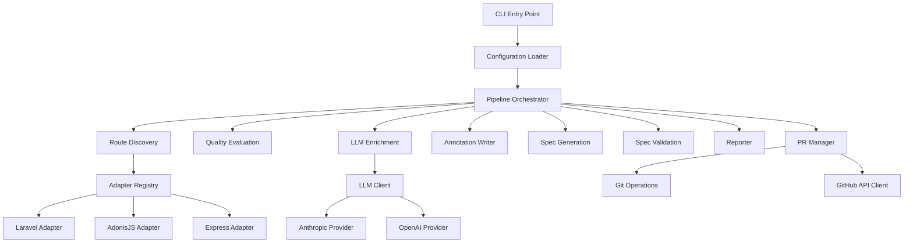
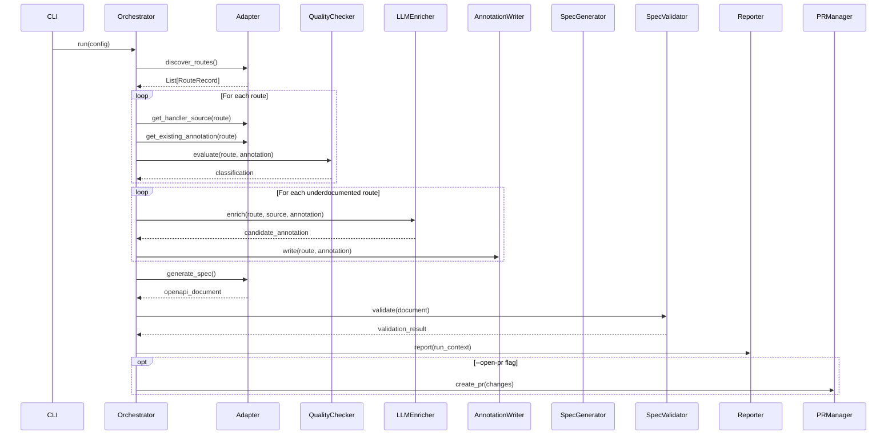

# Design Document: Swagger Auto-Documentation (Swadoc)

## Overview

Swadoc is a CLI-driven Python tool that automates OpenAPI documentation for multi-framework codebases. It follows a pipeline architecture: **Discover → Evaluate → Enrich → Write → Generate → Validate → Report (→ PR)**.

The tool is non-agentic — the LLM is used as a single-step text transformer per route. All orchestration, I/O, validation, and Git operations are deterministic Python code. The design targets Python 3.14+ and uses `asyncio` for concurrent LLM calls within the enrichment phase.

### Key Design Decisions

1. **Plugin-based adapter system**: Each framework (Laravel, AdonisJS, Express) is a self-contained adapter implementing a shared protocol (`AdapterProtocol`). New frameworks are added by registering an adapter — no orchestration code changes.
2. **Subprocess isolation for route discovery**: Laravel and AdonisJS route listing uses subprocess calls. Express uses static AST analysis via a bundled Node.js script. No target application code is executed.
3. **LLM provider abstraction**: A thin `LLMClient` interface wraps Anthropic and OpenAI SDKs. The client handles timeouts, retries, and response extraction.
4. **Backup-before-write safety**: Files are copied to `./autodoc-backup/` before any modification. Post-write syntax verification rolls back on failure.
5. **Structured reporting**: Every run produces a JSON report and stdout summary, enabling CI/CD integration.

## Architecture



### Pipeline Flow



## Components and Interfaces

### AdapterProtocol (Abstract Interface)

```python
from typing import Protocol

class AdapterProtocol(Protocol):
    """Protocol that all framework adapters must implement."""

    framework_id: str  # e.g., "laravel", "adonisjs", "express"

    def discover_routes(self, project_path: Path) -> list[RouteRecord]:
        """List all registered routes in the project."""
        ...

    def get_handler_source(self, route: RouteRecord, project_path: Path) -> HandlerSource:
        """Read the source code of a route's handler function."""
        ...

    def get_existing_annotation(self, route: RouteRecord, project_path: Path) -> AnnotationBlock | None:
        """Extract the existing documentation annotation for a route handler."""
        ...

    def write_annotation(self, route: RouteRecord, annotation: AnnotationBlock, project_path: Path) -> WriteResult:
        """Write a validated annotation block to the handler's source file."""
        ...

    def generate_spec(self, project_path: Path, output_path: Path) -> SpecGenerationResult:
        """Invoke the framework's native spec generator."""
        ...
```

### AdapterRegistry

```python
class AdapterRegistry:
    """Registry for framework adapters with conflict detection."""

    def register(self, adapter: AdapterProtocol) -> None:
        """Register an adapter. Raises if framework_id conflicts or protocol is incomplete."""
        ...

    def select(self, code_base: str, project_path: Path) -> AdapterProtocol:
        """Select the appropriate adapter based on code-base flag and project detection."""
        ...

    def list_registered(self) -> list[str]:
        """Return list of registered framework identifiers."""
        ...
```

### LLMClient

```python
class LLMClient(Protocol):
    """Protocol for LLM provider clients."""

    async def complete(self, prompt: str, timeout: float = 30.0) -> LLMResponse:
        """Send a prompt and return the response within the timeout."""
        ...


class LLMResponse:
    content: str
    usage: TokenUsage
    model: str


class LLMClientFactory:
    """Creates the appropriate LLM client based on provider configuration."""

    @staticmethod
    def create(provider: str, model: str, api_key: str) -> LLMClient:
        ...
```

### AnnotationQualityChecker

```python
class AnnotationQualityChecker:
    """Evaluates annotation completeness against quality criteria."""

    def evaluate(self, route: RouteRecord, annotation: AnnotationBlock | None, handler_source: HandlerSource) -> QualityResult:
        """
        Returns classification (Documented/Underdocumented) and list of missing fields.
        Inspects handler source for request body, headers, and path params usage.
        """
        ...
```

### PipelineOrchestrator

```python
class PipelineOrchestrator:
    """Coordinates the full Swadoc pipeline execution."""

    def __init__(self, config: SwadocConfig, adapter: AdapterProtocol, llm_client: LLMClient):
        ...

    async def run(self) -> RunReport:
        """Execute the full pipeline: discover → evaluate → enrich → write → generate → validate → report."""
        ...
```

### PRManager

```python
class PRManager:
    """Handles Git branching, committing, and GitHub PR creation."""

    def __init__(self, github_token: str, github_repo: str, project_path: Path):
        ...

    def create_branch(self, timestamp: str) -> str:
        """Create a uniquely-named branch. Handles collisions with -N suffix."""
        ...

    def commit_changes(self, files: list[Path], route_count: int) -> None:
        """Stage and commit modified files with the standard message."""
        ...

    async def open_pr(self, branch: str, description: str) -> str:
        """Open a PR via GitHub API with exponential backoff on rate limits. Returns PR URL."""
        ...
```

### Reporter

```python
class Reporter:
    """Generates stdout summary and JSON run report."""

    def print_summary(self, report: RunReport) -> None:
        """Print human-readable summary to stdout."""
        ...

    def write_report(self, report: RunReport, path: Path) -> None:
        """Write JSON run report to disk."""
        ...
```

## Data Models

```python
from dataclasses import dataclass, field
from enum import Enum
from pathlib import Path
from datetime import datetime


class RouteClassification(Enum):
    DOCUMENTED = "Documented_Route"
    UNDERDOCUMENTED = "Underdocumented_Route"


class EnrichmentOutcome(Enum):
    ENRICHED = "enriched"
    SKIPPED = "skipped"
    FAILED = "failed"
    NOT_ATTEMPTED = "not_attempted"


class FailureCategory(Enum):
    TIMEOUT = "timeout"
    LLM_CALL_FAILED = "llm_call_failed"
    LLM_RESPONSE_UNPARSEABLE = "llm_response_unparseable"
    FORMAT_MISMATCH = "format_mismatch"
    PRE_WRITE_VALIDATION_FAILED = "pre_write_validation_failed"
    POST_WRITE_PARSE_FAILURE = "post_write_parse_failure"
    BACKUP_FAILURE = "backup_failure"


@dataclass
class RouteRecord:
    method: str
    uri: str
    handler: str
    handler_file: Path | None
    handler_function: str | None


@dataclass
class HandlerSource:
    content: str
    file_path: Path
    function_name: str
    start_line: int
    end_line: int
    line_count: int
    was_truncated: bool = False
    original_line_count: int | None = None


@dataclass
class AnnotationBlock:
    raw_text: str
    format: str  # "phpdoc" or "jsdoc"
    summary: str | None = None
    operation_id: str | None = None
    responses: list[dict] = field(default_factory=list)
    request_body: dict | None = None
    headers: list[dict] = field(default_factory=list)
    path_params: list[dict] = field(default_factory=list)


@dataclass
class QualityResult:
    classification: RouteClassification
    missing_fields: list[str] = field(default_factory=list)
    warnings: list[str] = field(default_factory=list)


@dataclass
class WriteResult:
    success: bool
    file_path: Path
    error: str | None = None


@dataclass
class ValidationIssue:
    level: str  # "error" or "warning"
    route_uri: str | None
    annotation_id: str | None
    message: str


@dataclass
class SpecGenerationResult:
    success: bool
    document: dict | None = None
    error: str | None = None


@dataclass
class RouteReport:
    method: str
    uri: str
    handler: str
    classification: RouteClassification
    enrichment_outcome: EnrichmentOutcome
    failure_category: FailureCategory | None = None
    failure_reason: str | None = None
    validation_warnings: list[ValidationIssue] = field(default_factory=list)
    validation_errors: list[ValidationIssue] = field(default_factory=list)
    missing_fields: list[str] = field(default_factory=list)


@dataclass
class RunSummary:
    start_timestamp: str  # ISO 8601 UTC
    duration_ms: int
    routes_discovered: int
    routes_documented: int
    routes_enriched: int
    validation_warnings: int
    validation_errors: int


@dataclass
class RunReport:
    summary: RunSummary
    routes: list[RouteReport]
    dry_run: bool = False
    would_change: list[dict] | None = None  # Only in dry-run mode
    output_path: str | None = None
    pr_url: str | None = None


@dataclass
class SwadocConfig:
    code_base: str  # "node" or "php"
    project_path: Path
    output_path: Path
    dry_run: bool = False
    open_pr: bool = False
    llm_provider: str | None = None  # "anthropic" or "openai"
    llm_model: str | None = None
    llm_api_key: str | None = None
    github_token: str | None = None
    github_repo: str | None = None
```

